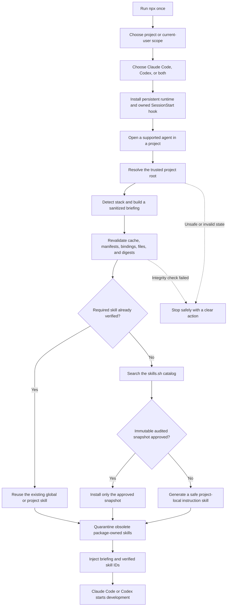

# Agent Skill Bootstrap

[](https://www.npmjs.com/package/agent-skill-bootstrap)
[](https://github.com/lucascharao/agent-skill-bootstrap/actions/workflows/ci.yml)
[](https://github.com/lucascharao/agent-skill-bootstrap/releases)
[](package.json)
[](LICENSE)

**Prepare the right project context and skills before Claude Code or Codex
starts developing.**

AI coding agents are powerful, but a new session often begins with the same
problem: the agent still needs to discover the stack, understand the project,
find the right instructions, and avoid installing tools that are already
available.

Agent Skill Bootstrap automates that preparation. You run one guided installer,
approve the host hook once, and future sessions begin with a verified project
briefing and only the skills that the project actually needs.

```bash
npx agent-skill-bootstrap
```

> No daemon, no `sudo`, and no machine-wide root installation. The "current
> user" option applies only to your operating-system account.

## What it does

After the initial setup, Agent Skill Bootstrap runs on the supported host's
`SessionStart` event:



In plain language:

1. It identifies what kind of project was opened.
2. It checks which skills are already installed before adding anything.
3. It searches the skills.sh catalog for relevant skills.
4. It automatically admits only immutable, audited API snapshots.
5. If no safe catalog snapshot qualifies, it creates a small local
   instruction-only skill from verified project evidence.
6. It gives the agent a sanitized briefing and the IDs of skills that were
   actually validated.
7. If a mandatory safety check fails, it blocks startup instead of claiming
   that the project is ready.

## Quick start

### 1. Run the guided installer

From the project you want to prepare:

```bash
npx agent-skill-bootstrap
```

The installer asks two simple questions:

1. Should automation apply to this project or all projects of the current user?
2. Should it configure Claude Code, Codex, or both?

It then installs a pinned persistent runtime, safely merges one owned
`SessionStart` hook, creates the first project briefing, and runs the first
skill cycle.

### 2. Approve the hook in the host

Claude Code and Codex control their own trust settings. Agent Skill Bootstrap
cannot and does not approve itself.

After the host approves the hook, preparation runs automatically whenever a
supported session starts. The user does not need to remember another bootstrap
command.

### 3. Start developing normally

Open Claude Code or Codex inside the project. The hook prepares the project
before the agent begins development.

For scripted or classroom setup:

```bash
npx agent-skill-bootstrap \
  --scope project \
  --agents claude-code,codex \
  --non-interactive
```

## Choose the right scope

| Scope           | Best for                              | Behavior                                                                        |
| --------------- | ------------------------------------- | ------------------------------------------------------------------------------- |
| Current project | Repositories with their own setup     | Runtime, state, hooks, and managed skills remain inside the project             |
| Current user    | Personal machines using many projects | One user-level runtime serves projects while state remains isolated per project |

Even in current-user scope:

- No `sudo` is used.
- Nothing is installed for other operating-system users.
- Project state is partitioned by canonical project root.
- Generated fallback skills stay inside their project.

## Supported today

| Capability         | v0.1.0 status                      |
| ------------------ | ---------------------------------- |
| Claude Code        | Supported and package-smoke tested |
| Codex              | Supported and package-smoke tested |
| Project scope      | Supported                          |
| Current-user scope | Supported                          |
| macOS              | Supported                          |
| Linux              | Supported                          |
| Windows            | Not promised in v0.1.0             |
| Grok Build         | Not promised in v0.1.0             |
| Lifecycle event    | `SessionStart` only                |

The project does not bypass host trust, disabled hooks, enterprise policy, or
filesystem permissions. A combination remains in the public support matrix only
when the packaged artifact proves its startup contract.

## How skills are selected safely

The skills.sh API is a catalog service; it is consumed, not installed.

The admission order is:

1. Reuse a verified global binding when one already satisfies the agent.
2. Reuse a verified project binding.
3. Search skills.sh using the authenticated API when credentials are available.
4. Admit an API result only when it provides an immutable file snapshot, a hash,
   an approved audit result, and sufficient project relevance.
5. Use the pinned official `skills@1.5.19` CLI for discovery only when an
   immutable API snapshot is unavailable.
6. Never auto-install a mutable branch, tag, or repository result.
7. Generate a deterministic, instruction-only local skill when no safe snapshot
   qualifies.

This means discovery can still show a useful remote candidate without silently
installing mutable remote content.

## Skill lifecycle

Agent Skill Bootstrap manages only assets carrying its own valid ownership
manifest and matching content digest.

```text
required + verified      → reuse
required + safe snapshot → install
required + no snapshot   → generate local instruction skill
no longer required       → move owned project skill to quarantine
unmanaged                → preserve
```

Obsolete package-owned project skills are moved to recoverable quarantine:

```text
.agent-skill-bootstrap/quarantine/
```

They are not permanently deleted automatically. Third-party skills and hooks
are preserved.

## Installation paths

| Host        | Project          | Current user                     |
| ----------- | ---------------- | -------------------------------- |
| Claude Code | `.claude/skills` | `~/.claude/skills`               |
| Codex       | `.agents/skills` | `${CODEX_HOME:-~/.codex}/skills` |

Codex current-user hooks respect the same home:

```text
${CODEX_HOME:-~/.codex}/hooks.json
```

Current-user state is isolated for each canonical project:

```text
~/.config/agent-skill-bootstrap/projects/<project-hash>/
```

## Commands

The guided installer is the only command most users need:

```bash
npx agent-skill-bootstrap
```

Diagnostics and maintenance are available when needed:

```bash
npx agent-skill-bootstrap scan
npx agent-skill-bootstrap sync
npx agent-skill-bootstrap analyze
npx agent-skill-bootstrap doctor
npx agent-skill-bootstrap prune --dry-run
npx agent-skill-bootstrap prune --yes
npx agent-skill-bootstrap quarantine
npx agent-skill-bootstrap restore <skill-id-or-slug> --yes
npx agent-skill-bootstrap uninstall --yes
```

Common options:

```text
--scope project|global
--agents claude-code,codex
--root <path>
--non-interactive
--dry-run
--force
--json
```

Run the built-in help for the exact command surface of the installed version:

```bash
npx agent-skill-bootstrap --help
```

## Doctor states

`doctor` separates installed files from verified host readiness:

- `supported-and-verified`: reserved for explicit host verification evidence.
- `trust-required`: runtime and hook are installed, but host approval is still
  required.
- `installed-but-unverified`: installation exists, but readiness could not be
  proven.
- `unsupported`: host, platform, or installation is outside the v0.1.0
  contract.

No success message claims that the host loaded a hook when that fact cannot be
verified.

## Security model

- Exact structured ownership markers for hook update and removal.
- Compare-and-swap and atomic replacement for hook configuration.
- Symlink rejection across managed boundaries, parents, staging, and
  destinations.
- Platform-aware path containment instead of unsafe string-prefix checks.
- Immutable snapshot, audit, size, file, and digest validation.
- Cache invalidation when any required binding or asset changes.
- Per-project state, briefing, cache, and sync lock.
- Bounded manifest inspection; no reading `.env`, credentials, prompt history,
  or arbitrary source files.
- OIDC credentials sent only to exact allowlisted HTTPS origins.
- No first-party telemetry is added by Agent Skill Bootstrap. Fallback discovery
  invokes the official skills CLI, whose anonymous telemetry can be disabled
  with `DISABLE_TELEMETRY=1` or `DO_NOT_TRACK=1`.

See [SECURITY.md](SECURITY.md) for the threat model and disclosure process.

## Three-minute classroom demo

1. Open a small Node.js, Python, or web project.
2. Run `npx agent-skill-bootstrap`.
3. Choose **current project** and one supported agent.
4. Show the generated owned hook and `.agent-skill-bootstrap` state.
5. Start Claude Code or Codex and approve the hook if requested.
6. Show the injected project briefing and selected/generated skills.
7. Run `npx agent-skill-bootstrap doctor` to explain installation versus trust.

The same demo can be repeated with current-user scope to show per-project state
isolation and global deduplication.

## Verification

Every release candidate must pass:

```bash
npm run format:check
npm run lint
npm run typecheck
npm test
npm run build
npm run test:coverage
npm audit --omit=dev
npm run smoke:package
npm pack --dry-run
```

The package smoke installs the real tarball in clean temporary homes. It reads
and executes the exact installed hook command for Claude Code and Codex in
project and current-user scopes, then verifies briefing creation, safe sync, and
uninstall.

## Repository and license

This repository is public for source visibility, issue reporting, teaching, and
release verification. External source-code contributions are not accepted.
Protected branches and pull requests guard the upstream repository.

Agent Skill Bootstrap is **source-available proprietary software, not open
source**. Official unmodified copies may be installed and used under
[LICENSE](LICENSE). Modification, derivative works, redistribution,
sublicensing, resale, or hosted redistribution require prior written
permission.

Generated project output remains available for the user's own projects as
described by the license.

## Documentation

- [Architecture](docs/ARCHITECTURE.md)
- [Lifecycle decision](docs/adr/0001-hybrid-lifecycle-bootstrap.md)
- [Testing strategy](docs/TESTING.md)
- [Security policy](SECURITY.md)
- [Release history](CHANGELOG.md)

## Links

- [npm package](https://www.npmjs.com/package/agent-skill-bootstrap)
- [GitHub releases](https://github.com/lucascharao/agent-skill-bootstrap/releases)
- [skills.sh](https://skills.sh)
