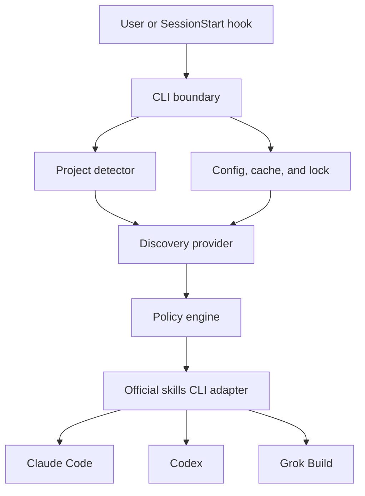

# Agent Skill Bootstrap Architecture

Status: Approved

Version: 1.0

Date: 2026-07-25

## Overview

This document defines the architecture, interfaces, security boundaries, and
delivery constraints for the first production-ready release of Agent Skill
Bootstrap. It is the implementation contract for the CLI and its three agent
adapters.

## Purpose

Agent Skill Bootstrap is a local-first Node.js CLI distributed through `npx`.
It detects a project's technology stack, discovers relevant skills in the
skills.sh ecosystem, skips skills already installed globally or locally, and
installs only the missing skills before Claude Code, Codex, or Grok Build starts
development work.

## Scope

In scope:

- Interactive installation at user or project scope.
- Detection from project manifests and well-known files.
- Authenticated skills.sh API v1 discovery when Vercel OIDC is available.
- Fallback discovery through the official `skills` CLI.
- Security filtering, audit-aware selection, and trusted-owner policy.
- Global-before-local deduplication.
- Claude Code, Codex, and Grok Build lifecycle adapters.
- Cache, lock, dry-run, doctor, uninstall, and machine-readable output.

Out of scope:

- Installing or configuring Claude Code, Codex, or Grok Build themselves.
- Silently bypassing hook trust or agent sandbox policies.
- Editing system-managed enterprise policies.
- Acting as a hosted proxy for skills.sh authentication.
- Silently rewriting shell profiles or shadowing vendor executables.

## Success Criteria

- `npx github:lucascharao/agent-skill-bootstrap` offers global or project
  installation before npm publication; the package is npm-ready.
- A repeated sync is idempotent and performs no duplicate installation.
- A project sync skips a matching global skill.
- Hooks preserve existing user or repository configuration.
- In native hook mode, offline or unavailable discovery never blocks an agent
  session. Strict mode fails closed and does not spawn the agent when policy
  requires a fresh discovery or audit result.
- Untrusted or failed-audit skills are not automatically installed by default.
- Linux, macOS, and Windows behavior is covered by tests where paths differ.

## Current State and Constraints

The skills.sh API v1 is not an anonymous public API. It requires a Vercel OIDC
bearer token. Local developer machines cannot be assumed to have one.

The official `skills` CLI already supports:

- Search with `npx skills find`.
- Project and global installation.
- Claude Code, Codex, and Grok Build targets.
- JSON inventory output.

Agent lifecycle support differs:

- Claude Code supports `SessionStart` in settings and can inject hook output.
- Codex supports `SessionStart` in `hooks.json`; non-managed hooks require trust.
- Grok Build supports personal and project hooks; project hooks require trust.
  Passive hook output is ignored, so the hook must do all work itself.

No design can guarantee execution in every IDE, cloud session, or managed
environment when the host disables hooks or denies network access. The CLI must
state that boundary instead of bypassing it.

## Options Considered

### Option A: Command wrappers

Install wrapper binaries for `claude`, `codex`, and `grok` that sync skills and
then execute the real agent.

Pros:

- Deterministic ordering before the agent process starts.
- Works without lifecycle-hook semantics.

Cons:

- Shadows vendor binaries on `PATH`.
- Can break upgrades, aliases, IDE integrations, and security expectations.
- Requires fragile executable discovery and recursion protection.

### Option B: Native hooks only

Write only each agent's supported `SessionStart` hook.

Pros:

- Uses vendor-supported lifecycle integration.
- Works from native CLI and compatible IDE surfaces.
- Does not shadow commands.

Cons:

- Requires explicit trust in Codex and project-scoped Grok.
- Hook discovery and skill refresh timing differ by host.
- Managed environments may disable hooks.

### Option C: Hybrid lifecycle integration

Install native hooks, expose explicit `sync`, `scan`, and `doctor` commands, and
persist a fast cache and lock. Hooks use the same sync engine in non-interactive
fail-open mode.

Pros:

- Best native coverage without command shadowing.
- One testable sync engine for hooks and manual use.
- Safe recovery when a host disables or skips hooks.
- Supports transparent startup and CI/headless workflows.

Cons:

- Cannot bypass required trust.
- The first Grok session may require restart if its runtime does not refresh
  newly installed skills dynamically.
- More adapter code than either single-strategy option.

Decision: Option C.

Two execution guarantees are exposed:

- Native mode: best-effort automatic startup through vendor hooks. It is the
  default and never bypasses host trust or policy.
- Strict mode: deterministic `agent-skill-bootstrap run <agent>`, which
  completes sync before spawning the vendor process. It does not shadow the
  vendor executable and is the supported choice when “before start” must be a
  hard guarantee.

The interactive installer runs an initial sync before reporting success in
both modes. A new project reached only through a global native hook may need one
agent restart when the host does not refresh skills dynamically.

## Architecture

### System Architecture Diagram



## Primary Data Flow

1. Resolve the effective config from defaults, user config, project config,
   environment variables, and CLI flags.
2. Resolve the project root without walking above the requested boundary.
3. Acquire a per-project lock. If another sync is running, return immediately.
4. Fingerprint relevant manifests. Use cached recommendations when unchanged
   and within TTL.
5. Detect technologies and produce bounded search queries.
6. Read global inventory first, then project inventory, including agent
   bindings for every installation.
7. Discover candidates using API v1 with OIDC, otherwise the official CLI.
8. Normalize candidates to stable `{source}/{skill}` identifiers.
9. Score relevance and apply duplicate, security, owner, audit, confidence, and
   result-limit policies.
10. Materialize an immutable snapshot or pinned repository revision, then
    install only the missing skill-to-agent bindings.
11. Persist state atomically and return a concise context message that
    distinguishes installed, available, restart-required, and failed states.

## Components

- **CLI boundary**: validates commands and flags, selects interactive or hook
  mode, and converts domain results into human or JSON output.
- **Project detector**: resolves a bounded project root and maps manifests and
  well-known files to deterministic technology signals.
- **Discovery providers**: implement a shared candidate interface for the
  authenticated API and official CLI fallback.
- **Inventory provider**: normalizes project and global installations before
  the policy engine makes any decision.
- **Policy engine**: makes pure, testable relevance, security, audit,
  deduplication, and install-limit decisions.
- **Skills CLI adapter**: runs the runtime-local, exact-version installer
  without a shell and converts process failures into domain errors.
- **Hook adapters**: merge owned lifecycle entries into vendor configuration
  without replacing unrelated user configuration.
- **State store**: persists cache and install results atomically without
  credentials or source file contents.

### Project detector

Input:

```yaml
cwd: absolute-path
max_depth: 4
```

Output:

```yaml
project_root: absolute-path
signals:
  - id: nextjs
    confidence: 1
    evidence:
      - package.json:dependencies.next
queries:
  - next.js react typescript
fingerprint: sha256
```

Detection must not read file contents outside the resolved project root.
Secrets and `.env` files are never inspected.

The built-in detection matrix is deterministic and can be extended in YAML:

```yaml
detection_rules:
  - id: nextjs
    manifests:
      package.json:
        dependencies:
          - next
    files:
      - next.config.*
    technology: Next.js
    confidence: 1
    queries:
      - next.js react typescript
    required_candidate_terms:
      - next
  - id: django
    manifests:
      pyproject.toml:
        dependencies:
          - django
    files:
      - manage.py
    technology: Django
    confidence: 1
    queries:
      - django python
    required_candidate_terms:
      - django
```

Monorepos aggregate signals by workspace and retain the evidence path. Ambiguous
signals remain separate rather than collapsing to one framework. Unknown
projects produce no automatic installation.

### Discovery provider

Input:

```yaml
query: string
limit: 10
token: optional-string
```

Output:

```yaml
candidates:
  - id: owner/repo/skill
    source: owner/repo
    skill: skill
    name: Skill Name
    installs: 0
    install_url: https://github.com/owner/repo
    duplicate: false
provider: skills-api-v1 | skills-cli
```

The API provider validates all JSON at the boundary. The CLI provider strips
ANSI sequences and accepts only the documented `owner/repo@skill` result form.

### Inventory provider

Reads the runtime-local skills CLI `list --json` separately at project and
global scope.
Malformed entries are ignored with a warning. Deduplication is performed by
`stable skill identity + target agent`. A global Claude-only installation
therefore skips Claude but still permits the missing Codex and Grok bindings.

A legacy name-only match never authorizes a skip. When source, stable ID, and
hash are unavailable, the item is reported as an ambiguous collision and
requires explicit resolution. Only stable ID, canonical source plus skill, or
equivalent content hash can prove identity.

### Policy engine

Default automatic-install policy:

- Reject catalog entries flagged as duplicates.
- Reject failed audits and high or critical risk.
- Require a passing audit when API audit data is available.
- Without audit data, allow automatic installation only from configured trusted
  owners.
- Require a project signal confidence at or above
  `relevance.minimum_signal_confidence`.
- Score candidates with the deterministic formula below.
- Require `relevance.minimum_candidate_score`; ties are resolved by audit
  status, trusted-owner order, install count, and stable ID.
- Record a human-readable recommendation reason with its project evidence.
- Install nothing automatically for an unknown project or below-threshold
  candidate.
- Cap automatic installs per sync.
- Never execute arbitrary scripts from a skill directly; delegate installation
  to the snapshot installer or pinned official CLI adapter.

Candidate scoring is a value from 0 to 1:

```text
candidate_text =
  normalize(name + stable_id + source + description_if_available)

required_term_gate =
  at least one required_candidate_term occurs in candidate_text

score =
  0.35 * signal_confidence
  + 0.15 * required_term_gate
  + 0.40 * query_token_coverage
  + 0.10 * trusted_owner_match
```

`query_token_coverage` is the number of unique normalized, non-stopword query
tokens present in `candidate_text` divided by the total unique query tokens.
Missing optional metadata contributes no tokens and never fails parsing. The
required-term gate is mandatory; a zero gate rejects the candidate regardless
of total score. Query token coverage of at least 0.50 is also mandatory, and the
default total threshold is 0.70. Repeated tokens never increase coverage.

For multiple signals or workspaces, each candidate is scored independently
against each signal and the highest score wins. Its winning signal and evidence
path become the recommendation reason. Equal scores are ordered by passing
audit, configured trusted-owner order, installs descending, then stable ID
ascending. Audit and trusted-owner admission remain policy gates outside the
formula.

Contract examples:

```yaml
- case: approved
  signal: nextjs
  candidate: vercel-labs/agent-skills/next-best-practices
  expected:
    required_term_gate: 1
    minimum_query_token_coverage: 0.5
    minimum_score: 0.7
- case: rejected_missing_required_term
  signal: nextjs
  candidate: owner/repo/generic-frontend
  expected:
    required_term_gate: 0
    installed: false
- case: rejected_keyword_stuffing
  signal: nextjs
  candidate_text: next next next generic
  expected:
    query_token_coverage: 0.25
    installed: false
- case: tie
  candidates:
    - trusted-b/skills/next
    - trusted-a/skills/next
  trusted_owner_order:
    - trusted-a
    - trusted-b
  expected_first: trusted-a/skills/next
```

### Hook adapters

Adapters merge only the owned hook entry and preserve unrelated hooks.
Every generated command invokes the installed package entry point with a
resolved scope and `--non-interactive`.

Project hooks use relative repository paths where supported. User hooks use the
package command available through the configured launcher.

### Persistent runtime

The transient `npx` initializer copies the package's compiled runtime into an
owned versioned directory:

- Project: `.agent-skill-bootstrap/runtime/<version>/`.
- User: platform config directory under `runtime/<version>/`.

During initial setup, the installer creates a private npm prefix inside that
runtime and installs the official `skills` package at the exact version locked
in this package's production dependency and lockfile. Version 1 pins
`skills@1.5.19` and therefore requires Node.js 22.20 or newer.

Hooks execute the pinned bootstrap runtime through a generated host-specific
launcher that resolves `node` from the current hook environment and validates
Node.js 22.20 or newer before loading application code. The skills adapter
executes `<runtime>/node_modules/skills/bin/cli.mjs` with that resolved
executable.
Hooks do not call `npx`, require npm registry access, or silently upgrade.
`update` installs a new version side-by-side, rewrites only owned hook entries,
verifies them, and then removes an unused old runtime.

The `run <claude|codex|grok> -- [args...]` command locates the vendor executable
without a shell, rejects recursion to its own binary, completes sync, and only
then spawns the agent. Generated commands are tested on macOS, Linux, and
Windows path fixtures.

Project launchers resolve the repository root at runtime instead of embedding
the checkout path:

- Claude uses `CLAUDE_PROJECT_DIR`.
- Codex first uses `git rev-parse --show-toplevel` from the hook `cwd`. For a
  non-Git project, it falls back to the normalized, existing hook `cwd` after
  confirming that it remains inside the configured project boundary.
- Grok uses `GROK_WORKSPACE_ROOT`.
- Windows uses `commandWindows` with equivalent environment/root resolution.

User launchers use the platform config directory. `doctor` validates PATH,
Node version, runtime presence, moved repositories, and launcher execution;
`doctor --repair` rewrites only owned entries after runtime-manager or path
changes.

### Immutable materialization

Authenticated API candidates are installed from the exact detail snapshot:

1. Fetch detail and audit results for the candidate.
2. Require a non-null catalog hash and file snapshot.
3. Reject absolute paths, traversal, symlinks, oversized files, and duplicate
   normalized paths.
4. Sort by normalized relative path and compute an internal SHA-256 over
   length-prefixed path and content bytes.
5. Stage the files in an owned temporary directory.
6. Copy the staged snapshot to the requested agent directories.
7. Recompute the internal digest from every installed copy.
8. Atomically commit state only when all digests match; otherwise remove the
   staged bindings and restore previous copies.

The skills.sh audit endpoint currently identifies the skill, not a documented
revision digest. Audit status is therefore an admission signal, not proof that
an arbitrary later Git checkout was audited. Installing from the same immutable
detail response removes download TOCTOU; both the catalog hash and internal
digest are persisted for future drift detection.

Fallback CLI discovery does not provide an audited immutable snapshot.
Automatic fallback installation is therefore limited:

- Native mode: only configured trusted owners; resolve the repository HEAD to a
  commit SHA, materialize that commit in a temporary directory, and pass the
  local pinned checkout to the runtime-local official CLI.
- Strict mode: never auto-install an unaudited fallback candidate. Stop before
  spawning the agent and provide the exact review/install action.
- If a canonical source or immutable revision cannot be resolved, emit a
  recommendation only.

## Integration

The integration layer has three independently replaceable boundaries: catalog
discovery, skill inventory/installation, and agent lifecycle configuration.
Every boundary validates external data, exposes typed domain results, and can be
replaced by a fake implementation in tests. No provider imports another
provider directly; the sync use case receives each port through dependency
injection. Network credentials are read only by the API adapter, while file and
process access remain isolated in their own adapters.

### skills.sh API v1

- Protocol: HTTPS JSON.
- Base URL option: `discovery.api_base_url`, accepted for automatic discovery
  only when its exact HTTPS origin is present in the user-owned discovery
  origin allowlist. The built-in allowlist contains only `https://skills.sh`.
- Authentication: fresh bearer token from `discovery.token_env`.
- Endpoints:
  - `GET /api/v1/skills/search`
  - `GET /api/v1/skills/{id}`
  - `GET /api/v1/skills/audit/{id}`
- Failure behavior: 401 switches to the official CLI in `auto` mode; 429 uses
  `Retry-After`; 503 uses bounded backoff.

API construction and limits:

- Search uses `URLSearchParams` with `q` (minimum two characters) and `limit`
  clamped to 1–10 for automatic discovery.
- Stable IDs are split into path segments, validated, percent-encoded
  independently, and joined under `/api/v1/skills/` or
  `/api/v1/skills/audit/`.
- Empty, dot, dot-dot, encoded-separator, control-character, and option-like
  segments are rejected.
- Search is not paginated by the published contract. Leaderboard pagination is
  not used.
- Adapter schemas are versioned as `SkillsSearchV1`, `SkillDetailV1`, and
  `SkillAuditV1`. Unknown fields are ignored; all required fields are validated.
- JSON responses are capped at 2 MiB. Detail snapshots are capped at 10 MiB,
  1,000 files, and 1 MiB per file.
- `Retry-After` accepts seconds or an HTTP date, is clamped to 0–10 seconds, and
  is honored once within the remaining budget.
- 503 retries at 250 ms and 750 ms with jitter, then uses valid cache or
  fallback.
- Connect timeout is 3 seconds and total live discovery budget is 12 seconds.

### Official skills CLI

- Package: exact production dependency `skills@1.5.19`.
- Executable: runtime-local `node_modules/skills/bin/cli.mjs`.
- Interfaces:
  - `find <query>` for fallback discovery.
  - `list --json` and `list --global --json` for inventory.
  - `add <source> --skill <name> --agent <agents> --copy --yes` for install.
- Commands are spawned with argument arrays and `shell: false`.
- `npx` is used only to bootstrap Agent Skill Bootstrap itself, never from a
  session hook.
- At runtime startup, the adapter checks the exact package version and probes
  required capabilities (`find`, `list --json`, project/global scopes,
  `add --skill`, agent targets, `--copy`, and non-interactive confirmation).
  Capability mismatch disables automatic fallback installation.

### Agent hosts

- Claude Code: user `~/.claude/settings.json` or project
  `.claude/settings.json`.
- Codex: user `~/.codex/hooks.json` or project `.codex/hooks.json`.
- Grok Build: user `~/.grok/hooks/*.json` or project
  `.grok/hooks/*.json`.

The installer surfaces required trust actions but never attempts to approve
them on behalf of the user.

## Hook Adapter Contracts

All owned hook entries carry the marker
`agent-skill-bootstrap:v1:<scope>:<agent>`. The installer:

- Uses `lstat` and refuses vendor config paths or parents that are symlinks.
- Parses and validates the complete JSON object before mutation.
- Records original mode bits and never broadens permissions.
- Reads the original content hash, writes a same-directory temporary file,
  rechecks the original hash, and renames only on compare-and-swap success.
- Creates a timestamped backup before the atomic rename.
- Rolls back when post-write parse or ownership verification fails.
- Removes only entries with its exact ownership marker.

### Claude Code

- User path: `~/.claude/settings.json`.
- Project path: `.claude/settings.json`.
- Event: `SessionStart`.
- Matcher: `startup|resume|clear|compact`.
- Handler: command, environment-resolved Node, and runtime-local CLI path.
- Root input: hook JSON `cwd` and `CLAUDE_PROJECT_DIR`.
- Timeout: 30 seconds by default.
- Output: zero with JSON `additionalContext` for success or restart-required;
  non-zero SessionStart failure remains non-blocking.

```json
{
  "matcher": "startup|resume|clear|compact",
  "hooks": [
    {
      "type": "command",
      "command": "\"<node>\" \"<runtime>/cli.mjs\" hook --agent claude-code",
      "timeout": 30,
      "statusMessage": "Checking project skills",
      "_agentSkillBootstrap": "agent-skill-bootstrap:v1:<scope>:claude-code"
    }
  ]
}
```

### Codex

- User path: `~/.codex/hooks.json`.
- Project path: `.codex/hooks.json`.
- Event: `SessionStart`.
- Matcher: `startup|resume|clear|compact`, based on Codex's own documented
  `SessionStart` start-source contract. The adapter owns this matcher
  independently and does not infer parity from Claude configuration.
- Handler includes `commandWindows` with platform-native quoting.
- Input: JSON on stdin with `cwd`, `hook_event_name`, and startup source.
- Timeout: 30 seconds by default.
- Hooks feature must be enabled and a non-managed hook must be reviewed and
  trusted in `/hooks`; the CLI never changes trust state.

### Grok Build

- User path: `~/.grok/hooks/agent-skill-bootstrap.json`.
- Project path: `.grok/hooks/agent-skill-bootstrap.json`.
- Event: `SessionStart`; passive stdout is not treated as agent context.
- Input: Grok camelCase JSON plus `GROK_WORKSPACE_ROOT`, normalized internally.
- Timeout: 30 seconds by default.
- Project hooks require `/hooks-trust` or explicit host `--trust`; the CLI never
  changes `trusted_folders.toml`.

### First-session visibility

| Host        | Native hook order                         | Newly installed skill visible immediately   | Native contract           |
| ----------- | ----------------------------------------- | ------------------------------------------- | ------------------------- |
| Claude Code | Session already created                   | Not assumed                                 | Restart may be required   |
| Codex       | Session configured before hook            | Dynamic detection exists, but not relied on | Verify or request restart |
| Grok Build  | Extensions discovered before passive hook | Not assumed                                 | Restart may be required   |

Native mode never reports `loaded` without a host verification signal; it
reports `installed_restart_required` otherwise. Strict mode completes sync
before the agent process exists and is the only hard first-session guarantee.

## Configuration

Configuration parameters and CLI override options are YAML-backed and validated
before use.

```yaml
version: 1
scope: project
agents:
  - claude-code
  - codex
  - grok
discovery:
  api_base_url: https://skills.sh
  provider: auto
  token_env: VERCEL_OIDC_TOKEN
  query_limit: 10
  cache_ttl_minutes: 1440
security:
  require_audit: true
  allow_unaudited_from_trusted_owners: true
  trusted_owners:
    - anthropics
    - openai
    - vercel-labs
    - supabase
  blocked_risk_levels:
    - HIGH
    - CRITICAL
installation:
  max_skills_per_sync: 5
  copy: true
  fail_open_on_hook: true
detector:
  max_depth: 4
  ignored_directories:
    - .git
    - node_modules
    - vendor
    - dist
    - build
logging:
  level: info
relevance:
  minimum_signal_confidence: 0.8
  minimum_query_token_coverage: 0.5
  minimum_candidate_score: 0.7
```

Configuration precedence, highest first:

1. CLI flags.
2. Environment variables.
3. Project `.agent-skill-bootstrap/config.yaml`.
4. User config in the platform config directory.
5. Built-in defaults.

Security-sensitive fields do not follow ordinary precedence. Project config may
only strengthen the user security floor:

- It cannot change `discovery.token_env`, `discovery.api_base_url`, either
  discovery/credential origin allowlist, or send credentials to another
  `api_base_url`.
- It cannot disable `security.require_audit`, add trusted owners, remove blocked
  risks, lower thresholds, raise response limits, or increase automatic
  installs.
- It may require stricter audits, remove trusted owners, add blocked risks,
  raise thresholds, lower limits, or disable automatic installation.

Automatic API discovery and installation are accepted by default only from the
exact HTTPS origin `https://skills.sh`. Additional discovery origins and
credential origins require separate exact allowlist entries in user config,
never project config. A user-selected alternate base URL that is absent from
the discovery allowlist is diagnostic-only and cannot provide an audit or
snapshot used for automatic installation. Redirects never forward the
Authorization header across origins.

## State and Deduplication

Project state lives under `.agent-skill-bootstrap/state.json`. User state lives
under the platform config directory and is partitioned as
`projects/<sha256-project-identity>/state.json`, with a sibling lock and cache.
Project identity is a hash of canonical root path plus normalized Git remote
when available. Global mode does not write state or cache into the repository.
State contains no credentials.

```yaml
version: 1
project_fingerprint: sha256
last_sync_at: ISO-8601
installed:
  - id: owner/repo/skill
    scope: global
    agents:
      - codex
    hash: optional-sha256
```

Deduplication keys, in order:

1. Stable skills.sh `id` plus target agent.
2. Normalized `source + skill` plus target agent.
3. Equivalent normalized content hash plus target agent.

An installation request is the set difference between desired and existing
skill-to-agent bindings. No scope-wide match can suppress a missing binding,
and a name-only legacy collision is never included in `existing`.

## Error Handling

- Interactive commands fail closed with an actionable message.
- Session hooks fail open by default and emit a warning.
- HTTP 401 switches to the CLI fallback when provider is `auto`.
- HTTP 429 respects `Retry-After` once, then uses cache or fallback.
- HTTP 503 retries with bounded exponential backoff.
- Invalid API JSON is rejected and never reaches the installer.
- Partial installs are recorded individually; state is written atomically.
- Stale locks are recovered only after validating owner PID and age.
- Strict mode waits for an existing lock owner to finish, validates its result,
  and times out closed before spawning the agent. Native mode waits only within
  its hook budget, then returns an explicit `sync_in_progress` fail-open state.
- Hook success never claims that a skill is loaded when the host reports a
  restart-required state.

## Security

- Never persist OIDC tokens.
- Read the token fresh from the configured environment variable.
- Never inspect `.env`, credentials, SSH material, or arbitrary source files.
- Reject path traversal in skill file metadata.
- Spawn commands without a shell and pass arguments as an array.
- Preserve hook trust prompts; never set bypass flags.
- Default to copied skill files for predictable discovery and review.
- Include a security policy and vulnerability reporting process.

## Observability

Human output is concise. `--json` emits structured events:

```yaml
event: sync.completed
project_root: /path/to/project
detected:
  - nextjs
installed:
  - vercel-labs/agent-skills/next-best-practices
skipped_global:
  - vercel-labs/agent-skills/frontend-design
provider: skills-api-v1
duration_ms: 842
```

No project file contents, prompt text, token, hostname, or username are logged.

## Deployment

The package is distributed as an npm package with an ESM executable and a
compiled `dist/` directory. The first release targets Node.js 22.20 or newer on
macOS, Linux, and Windows, matching the pinned official skills CLI engine. It
has no daemon or privileged system service.

Before npm publication, GitHub's npm package spec is supported:
`npx github:lucascharao/agent-skill-bootstrap`. A later npm publish enables the
short form without changing the installed persistent runtime contract.

Release artifacts are checked with `npm pack --dry-run`. GitHub Actions runs
format, lint, typecheck, unit, integration, coverage, and package smoke tests.

## Performance

- Cached unchanged projects target a hook duration below 250 ms.
- Live discovery has a configurable timeout and never exceeds the host hook
  timeout.
- Manifest detection reads only bounded, well-known files.
- Search queries and installations are capped.
- Concurrent starts coalesce through one lock.

## Monitoring

The local CLI has structured opt-in diagnostic output, not remote telemetry.
`doctor` reports provider reachability, hook presence, trust instructions,
inventory health, cache state, and supported agent availability.

## Testing

The complete strategy is defined in `docs/TESTING.md`. Core policy and
deduplication require full branch coverage. Live services and real user agent
directories are never used by automated tests.

## Risks and Mitigations

- API requires Vercel OIDC.
  - Mitigation: official CLI fallback and clear doctor output.
- Skill supply-chain risk.
  - Mitigation: audits, trusted owners, install cap, copy mode, and dry-run.
- Startup latency.
  - Mitigation: manifest fingerprint, 24-hour cache, and process lock.
- Concurrent agent startup.
  - Mitigation: atomic per-project lock and idempotent inventory checks.
- Hook trust is skipped or disabled.
  - Mitigation: explicit `doctor` and `sync`; never claim universal enforcement.
- Runtime does not refresh new skills.
  - Mitigation: hook returns a restart notice; doctor verifies discovery.
- Existing config corruption.
  - Mitigation: parse, merge owned entries, backup, atomic rename, and tests.

## Validation

Architecture review:

- Product perspective: APPROVE after two correction rounds.
- Technical perspective: APPROVE after three correction rounds.
- User perspective: Option C selected as the closest implementation of the
  requested automatic behavior, with documented host limitations.

Independent approvals are recorded in `docs/reviews/`; implementation may
begin.
