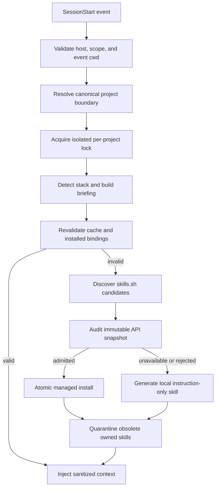

# Agent Skill Bootstrap Architecture

Status: Release candidate

Version: 0.1

Date: 2026-07-26

## Contract

Version 0.1 supports Claude Code and Codex on macOS and Linux. The installer
can configure the current project or current user. One owned `SessionStart`
hook must complete preparation before the host receives additional context.
Preparation failure stops the hook with `continue: false`.

Host trust remains mandatory. The runtime never claims that a configured hook
has been loaded or approved without explicit host evidence.

## Runtime flow



## Boundaries

Project roots are resolved from the trusted event `cwd`. Project-scope hooks
require that event directory to remain inside the configured project boundary.
Current-user hooks walk upward only until the nearest recognizable project
marker. Missing, relative, nonexistent, or out-of-bound roots fail closed.

Managed writes validate:

- Platform-aware containment with `path.relative`
- The boundary itself and every existing parent
- No symlink at boundary, parent, staging, destination, or managed content
- Destination state immediately before atomic rename
- Compare-and-swap for shared hook configuration

## Paths

Project skills:

- Claude Code: `.claude/skills`
- Codex: `.agents/skills`

Current-user skills:

- Claude Code: `~/.claude/skills`
- Codex: `${CODEX_HOME:-~/.codex}/skills`

Codex user hooks use `${CODEX_HOME:-~/.codex}/hooks.json`. Claude Code user
hooks use `~/.claude/settings.json`.

Project state is stored under `.agent-skill-bootstrap`. Current-user state,
briefing, and lock are isolated by a SHA-256-derived canonical project key:

```text
~/.config/agent-skill-bootstrap/projects/<project-key>/
```

The persistent runtime is versioned under the selected scope. It contains the
bundled CLI, the exact Node executable recorded during setup, and a copied
`skills@1.5.19` discovery runtime.

## Discovery and admission

The authenticated skills.sh API is preferred when its Vercel OIDC credential is
available. An API candidate is installed only when:

- Relevance and query-coverage policy passes
- Required audit policy passes
- Risk is allowed
- The API returns an immutable hash and complete file snapshot
- Snapshot paths, contents, and digest validate

Without an immutable audited snapshot, the pinned official CLI may search the
catalog but never materializes or executes the remote candidate. If every
required agent already has a verified binding, that binding can be reused.
Otherwise a deterministic instruction-only skill is generated inside the
project.

## Cache invariant

Fingerprint and TTL are necessary but insufficient. A cache hit is accepted
only when every required skill has, for every target agent:

- An expected binding
- A valid Agent Skill Bootstrap ownership manifest
- A present root `SKILL.md`
- No symlinked content
- A content digest matching the manifest

Any missing, modified, corrupt, or quarantined binding invalidates the cache.
The runtime recomputes safely; an occupied corrupt destination causes a
fail-closed error instead of false readiness.

## Hook ownership

Owned hook entries use an exact structured command argument:

```text
--owner 'agent-skill-bootstrap:v1:<scope>:<agent>'
```

Install, update, runtime validation, and uninstall use the same exact suffix
predicate on a documented command handler. Merely mentioning the package or
marker elsewhere does not grant ownership. Hook files are parsed as JSON
objects, backed up, checked for concurrent modification, and replaced atomically.

## Maintenance

Only project skill directories with a valid package ownership manifest are
eligible. Obsolete bindings move atomically to:

```text
.agent-skill-bootstrap/quarantine/<agent>/<slug>
```

Automatic operation never permanently deletes skill content. Invalid,
unmanaged, external, or symlinked directories remain untouched.

## Explicit exclusions

- Grok Build: passive startup output cannot prove first-response context loading
- Windows: not part of the tested 0.1 release matrix
- Command shims or vendor executable shadowing
- Automatic hook trust approval
- Mutable catalog installation
- Background daemon
